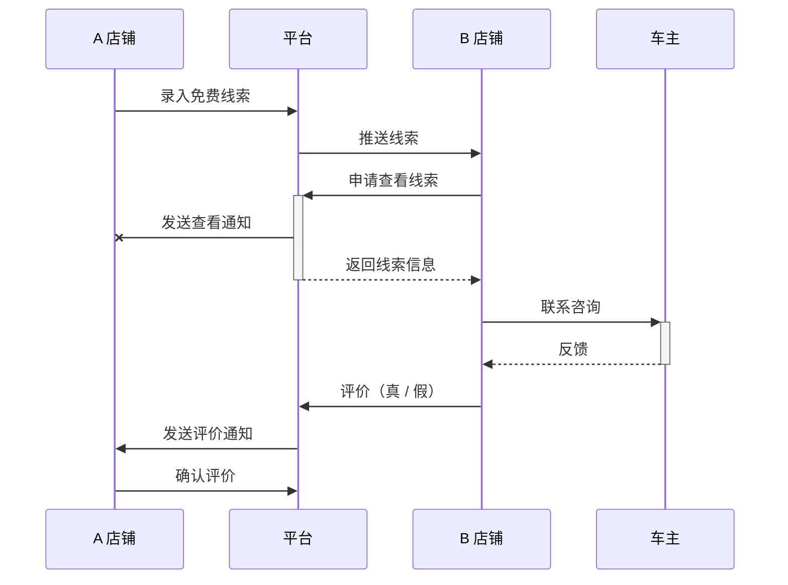
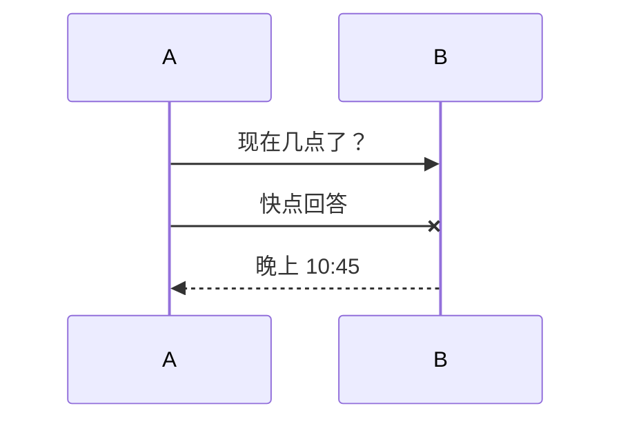
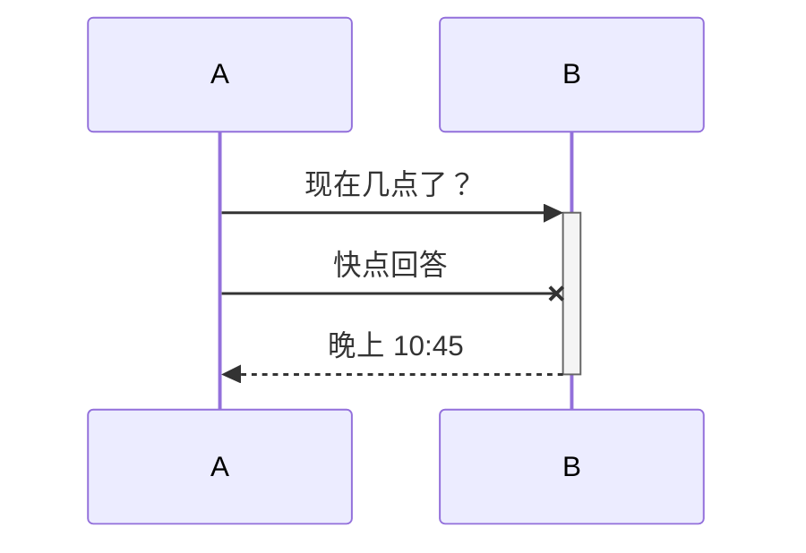

# Mermaid & Visual Studio Code 使用说明

Mermaid 插件可以让你在 VS Code 中使用 Markdown 画出 `时序图` `流程图` 与 `甘特图`。

## 需要安装的插件

- Markdown Preview Mermaid Support
- Markdown All in One

## 时序图

### 消息

- `->>` 实线箭头，表示发送消息。
- `-->>` 虚线箭头，表示响应消息。
- `-x` 实线箭头带 x，表示异步操作，无需等待响应。

### 激活框

- `->> +` 表示从消息接受方的时间线上标记一个时间段的开始。
- `->> -` 表示从消息放回方的时间线上标记一个时间段的结束。`

### 选择（alt）

TODO

### 循环（loop）

TODO

## 流程图

TODO

- nihc
- nihc
